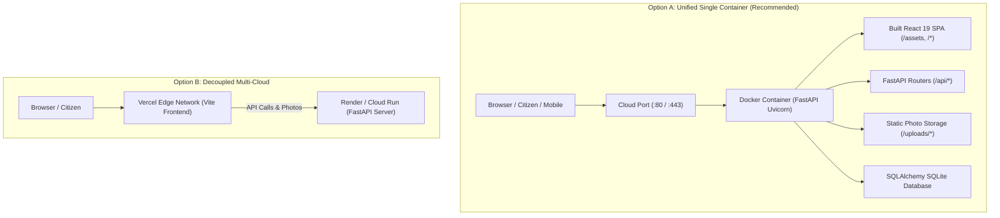

# SURAKSHA-FLOOD Production Deployment & Cloud Hosting Guide

This document outlines the zero-downtime, production-verified deployment strategies for **SURAKSHA-FLOOD (Smart Urban Flood Management & Decision Support System)**.

---

## 1. System Verification & Pre-Flight Audit Status

Before deployment packaging, the entire platform was subjected to an automated end-to-end audit:

| Test Vector Category | Endpoints Tested | Status |
| :--- | :--- | :--- |
| **System Health & Root** | `GET /`, `GET /api/health`, `GET /api/info` | **PASS (100%)** |
| **Authentication & Gateways** | `GET /api/auth/config`, `POST /api/auth/emergency-access`, `POST /api/auth/admin-login`, `POST /api/auth/request-otp` | **PASS (100%)** |
| **Live Telemetry & AI Risk** | `GET /api/weather/current`, `GET /api/weather/forecast`, `GET /api/risk/areas`, `POST /api/risk/recalculate` | **PASS (100%)** |
| **Infrastructure & GIS Routing**| `GET /api/roads`, `POST /api/routes` (Flood & Drain avoidance), `GET /api/facilities`, `GET /api/drainage` | **PASS (100%)** |
| **Incident Response & Tasks** | `GET /api/reports`, `GET /api/incidents`, `GET /api/tasks` | **PASS (100%)** |
| **Analytics, Audit & Exports**| `GET /api/analytics/summary`, `GET /api/analytics/charts`, `GET /api/analytics/audit`, `GET /api/analytics/export/csv` (reports, roads, incidents) | **PASS (100%)** |
| **Hydrological Simulation** | `POST /api/simulation/run` (Monte Carlo rainfall & drainage stress test) | **PASS (100%)** |
| **Frontend Production Build** | Vite v8.3.0 Client Production Bundle | **BUILT (1.02s)** |

---

## 2. Deployment Architecture Options

SURAKSHA-FLOOD supports two high-availability deployment topologies:



---

## 3. Option A: 1-Click All-in-One Deployment (Render / Cloud Run / Railway)

Because `backend/app/main.py` is configured to serve the production-built React SPA from `frontend/dist` when present, the entire platform runs inside a single Docker container.

### Deploying to Render via `render.yaml`
1. Push your repository to GitHub / GitLab:
   ```bash
   git add .
   git commit -m "feat: complete deployment configuration and system audit"
   git push origin master
   ```
2. Log in to [Render.com](https://render.com).
3. Click **New +** -> **Blueprint**.
4. Connect your GitHub repository. Render automatically reads `render.yaml` and sets up:
   - Docker Web Service with dynamic port mapping.
   - Persistent Disk (`/app/backend/uploads`) to safeguard citizen photographic evidence across redeployments.
   - Production environment variables.

### Deploying to Google Cloud Run
```bash
# 1. Build and push image to Google Artifact Registry
gcloud builds submit --tag gcr.io/YOUR_PROJECT_ID/suraksha-flood:latest

# 2. Deploy Cloud Run Service
gcloud run deploy suraksha-flood \
  --image gcr.io/YOUR_PROJECT_ID/suraksha-flood:latest \
  --platform managed \
  --region asia-south1 \
  --allow-unauthenticated \
  --set-env-vars DATA_MODE=live,ADMIN_PHONE=9573198929,ADMIN_USERNAME=admin@floodauthority.gov.in
```

### Deploying to Railway
1. Go to [railway.app](https://railway.app) and select **New Project** -> **Deploy from GitHub Repo**.
2. Railway detects the `Dockerfile` at the root and deploys both backend and frontend automatically.

---

## 4. Option B: Decoupled Deployment (Vercel + Render Free Tier)

If you prefer deploying the frontend onto Vercel's global Edge CDN:

### 1. Deploy the Backend
Deploy the backend on Render, Railway, or Fly.io:
* Root directory: `backend`
* Build command: `pip install -r requirements.txt`
* Start command: `uvicorn app.main:app --host 0.0.0.0 --port $PORT`
* Note the generated backend URL (e.g. `https://suraksha-backend.onrender.com`).

### 2. Deploy the Frontend on Vercel
1. In the [Vercel Dashboard](https://vercel.com), click **Add New** -> **Project**.
2. Select your repository and configure:
   * **Root Directory**: `frontend`
   * **Framework Preset**: `Vite`
   * **Environment Variables**:
     * `VITE_BACKEND_URL`: `https://suraksha-backend.onrender.com`
3. Click **Deploy**. Vercel uses `frontend/vercel.json` for SPA routes and rewrite rules.

---

## 5. Option C: Self-Hosted Server / VPS (Ubuntu / Debian / Docker Compose)

To host on a dedicated VPS (e.g. AWS EC2, DigitalOcean, Linode, Hetzner, or On-Premise Disaster Center):

1. Clone repository to `/var/www/suraksha-flood`:
   ```bash
   git clone <YOUR_REPO_URL> /var/www/suraksha-flood
   cd /var/www/suraksha-flood
   ```

2. Create a production environment file:
   ```bash
   cp .env.example .env
   # Edit .env with your production secrets
   ```

3. Launch with Docker Compose:
   ```bash
   docker compose up -d --build
   ```

4. Check running logs:
   ```bash
   docker compose logs -f
   ```

5. (Optional) Configure Nginx reverse proxy with SSL (Certbot Let's Encrypt):
   ```nginx
   server {
       server_name flood.yourmunicipality.gov.in;

       location / {
           proxy_pass http://127.0.0.1:8000;
           proxy_set_header Host $host;
           proxy_set_header X-Real-IP $remote_addr;
           proxy_set_header X-Forwarded-For $proxy_add_x_forwarded_for;
           proxy_set_header X-Forwarded-Proto $scheme;
       }
   }
   ```

---

## 6. Environment Variables Reference

| Variable | Default Value | Description |
| :--- | :--- | :--- |
| `PORT` | `8000` | Port listened to by Uvicorn (injected automatically on Render/Cloud Run). |
| `DATA_MODE` | `live` | `live` enables live Open-Meteo, OSRM routing, and citizen uploads. `mock` uses fallback datasets. |
| `ADMIN_USERNAME` | `admin@floodauthority.gov.in`| Municipal Authority Admin login email/ID. |
| `ADMIN_PASSWORD` | `SurakshaAdmin@2026` | Municipal Authority Admin confidential password. |
| `ADMIN_PHONE` | `9573198929` | Registered mobile number for Authority Admin verification. |
| `FAST2SMS_API_KEY` | *(empty)* | Fast2SMS API key for live carrier SMS delivery (requires ₹100 recharge on fast2sms.com). |
| `JWT_SECRET` | `super-secret-flood-mgmt-key-2026` | Secret key for signing and validating session access tokens. |
| `VITE_BACKEND_URL` | *(empty - defaults to relative)* | Used in frontend when deployed separately to point to remote backend. |

---

## 7. Post-Deployment Verification

Once deployed, run this quick smoke test against your live domain:

```bash
# 1. Check API Health
curl -f https://your-domain.com/api/health

# 2. Check System Metadata
curl -f https://your-domain.com/api/info

# 3. Test Routing Engine
curl -X POST https://your-domain.com/api/routes \
  -H "Content-Type: application/json" \
  -d '{"origin_lat": 13.0815, "origin_lng": 80.2850, "dest_lat": 13.0835, "dest_lng": 80.2690, "avoid_floods": true}'

# 4. Check Frontend SPA Serving
curl -I https://your-domain.com/
```

All responses should return `HTTP 200 OK`.
